# Лабораторная работа №3. Фильтрация и анализ временных рядов

**Студентки:** Автономова Ксения, Лорс Алина, Васюнина София  
**Группа:** J3214
**Вариант:** 21
**Дата выполнения:** 2026

## Аннотация

В работе реализованы четыре метода фильтрации временных рядов: скользящее среднее, фильтр Калмана, фильтр Савицкого–Голея и вейвлет-фильтрация Хаара. Методы применены к данным о продажах (вариант 21 из файла `sell.csv`) и к внешнему датасету UCI Air Quality. Проведён сравнительный анализ по метрикам шероховатости и среднего абсолютного отклонения. Выполнен статистический, корреляционный, автокорреляционный и спектральный анализ рядов. Сделаны выводы о применимости фильтров и характере данных.

## 1. Цель работы

Реализовать и сравнить несколько методов фильтрации временных рядов, применить их к данным своего варианта, визуализировать результаты, проанализировать характеристики рядов (тренд, периодичность, корреляции) и сделать обоснованные выводы. Дополнительная часть – применение методов к внешнему датасету с несколькими сенсорными показателями.

## 2. Исходные данные и определение варианта

Файл `sell.csv` содержит ежедневные продажи пяти товаров (мыло, порошок, средство, краска, пена) и прибыль за 50 дней. Номер варианта вычисляется как сумма цифр ИСУ по модулю 60. Для ИСУ 474321 сумма = 21, вариант = 21. Из общего файла выделены соответствующие 50 строк. Первые пять строк показаны в таблице 1.

**Таблица 1 – Первые строки данных варианта 21**

| day | мыло | порошок | средство | краска | пена | прибыль |
|-----|------|---------|----------|--------|------|---------|
| 1   | 71   | 20      | 19       | 44     | 19   | 26.418  |
| 2   | 101  | 16      | 20       | 46     | 19   | 29.583  |
| 3   | 87   | 27      | 19       | 44     | 18   | 25.868  |
| 4   | 92   | 17      | 20       | 42     | 20   | 28.389  |
| 5   | 86   | 16      | 20       | 41     | 16   | 26.939  |

**Рисунок 1 – Исходные временные ряды для варианта 21**  
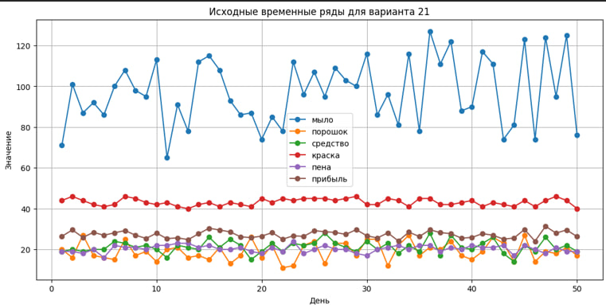

На рисунке 1 видны различные масштабы показателей (мыло 65–127, прибыль 24–31). Все ряды содержат случайные колебания, что делает фильтрацию целесообразной для выделения тренда.

## 3. Реализованные методы фильтрации

Все методы реализованы на языке Python с использованием библиотек NumPy, SciPy, PyWavelets. Для каждого метода описан принцип работы и выбраны параметры.

### 3.1 Скользящее среднее (Simple Moving Average)

Сглаживание заменой каждого значения на среднее арифметическое соседних значений в окне шириной \(2k+1\):
\[
y_t' = \frac{1}{2k+1} \sum_{j=-k}^{k} y_{t+j}
\]
Выбрано окно \(k=2\) (ширина 5 дней), так как оно обеспечивает умеренное сглаживание без чрезмерного запаздывания.

### 3.2 Фильтр Калмана

Реализован дискретный линейный фильтр Калмана для модели случайного блуждания с постоянной скоростью изменения. Уравнения:
- **Предсказание:** \( \hat{x}_{t|t-1} = F \hat{x}_{t-1|t-1} \), \( P_{t|t-1} = F P_{t-1|t-1} F^T + Q \)
- **Обновление:** \( K_t = P_{t|t-1} H^T (H P_{t|t-1} H^T + R)^{-1} \), \( \hat{x}_{t|t} = \hat{x}_{t|t-1} + K_t (z_t - H \hat{x}_{t|t-1}) \), \( P_{t|t} = (I - K_t H) P_{t|t-1} \)

Параметры: \(F = [[1,1],[0,1]]\) (состояние включает значение и тренд), \(H = [1,0]\), \(Q = 0.001 \cdot I\), \(R = 0.1\) (шум измерений). Начальное состояние взято из первого измерения.

### 3.3 Фильтр Савицкого–Голея

Сглаживание путём локальной аппроксимации полиномом низкой степени методом наименьших квадратов. Выбран полином 2-й степени (квадратичный) и окно 7 точек. Такой фильтр хорошо сохраняет форму сигнала (пики и впадины), в отличие от скользящего среднего.

### 3.4 Вейвлет-фильтрация Хаара (hard-часть)

Применено дискретное вейвлет-преобразование (DWT) с вейвлетом Хаара. Уровень разложения – 3. Пороговая обработка детализирующих коэффициентов выполнялась мягким порогом (soft thresholding) с порогом, равным \( \sigma \sqrt{2 \log N} \), где \(\sigma\) – медианная оценка шума на первом уровне. Затем выполняется обратное преобразование.

## 4. Сравнение фильтров на ряде «Прибыль»

Для количественной оценки качества фильтрации использованы две метрики:
- **Среднее абсолютное отклонение (MAE)** от исходного ряда – характеризует сохранение исходной формы.
- **Шероховатость** – сумма квадратов разностей между соседними отсчётами: \( R = \sum_{t=1}^{n-1} (y_{t+1}' - y_t')^2 \). Чем меньше шероховатость, тем глаже ряд. Снижение шероховатости вычислено относительно исходного ряда.

**Рисунок 2 – Сравнение всех фильтров для прибыли**  
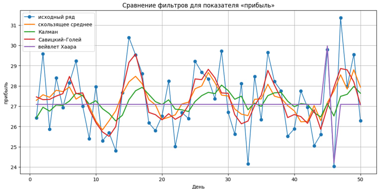

**Таблица 2 – Численное сравнение фильтров для прибыли**

| Метод              | MAE (абс. отклонение) | Шероховатость | Снижение шероховатости, % |
|--------------------|----------------------|---------------|---------------------------|
| Калман             | 1.252                | 0.373         | 85.45                     |
| Скользящее среднее | 1.217                | 0.534         | 79.18                     |
| Савицкий–Голей     | 1.073                | 0.749         | 70.83                     |
| Вейвлет Хаара      | 1.364                | 1.008         | 60.75                     |
| *Исходный ряд*     | –                    | 2.564         | –                         |

**Анализ:**  
- Фильтр Калмана даёт наибольшее сглаживание (шероховатость снижена на 85.45%) и наиболее плавную линию.  
- Фильтр Савицкого–Голея имеет наименьшее MAE (1.073), т.е. лучше других сохраняет форму исходного ряда, что важно при анализе локальных изменений.  
- Скользящее среднее – простой компромисс.  
- Вейвлет-фильтрация показала наименьшее сглаживание из-за мягкого порога и относительно короткого ряда.

## 5. Фильтрация всех показателей

Для каждого из шести показателей построены отдельные графики (рисунки 3–8). Видно, что характер фильтрации одинаков для разных рядов:  
- Калман – максимально гладкий, иногда «срезает» пики.  
- Савицкий–Голей – повторяет форму исходного ряда, но убирает высокочастотный шум.  
- Скользящее среднее – слегка запаздывает относительно резких изменений.  
- Вейвлет – удаляет мелкие флуктуации, но оставляет часть шума.

**Рисунок 3 – Фильтрация ряда «мыло»**  
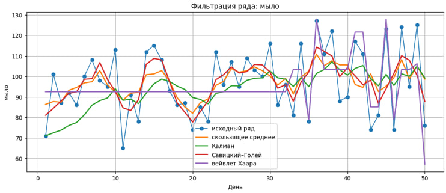  
**Рисунок 4 – Фильтрация ряда «порошок»**  
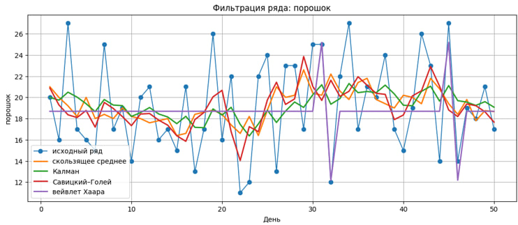  
**Рисунок 5 – Фильтрация ряда «средство»**  
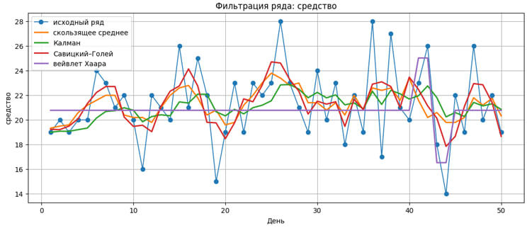  
**Рисунок 6 – Фильтрация ряда «краска»**  
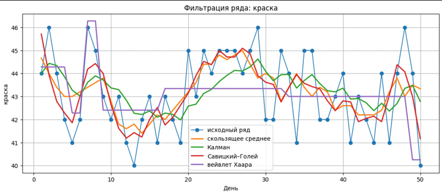  
**Рисунок 7 – Фильтрация ряда «пена»**  
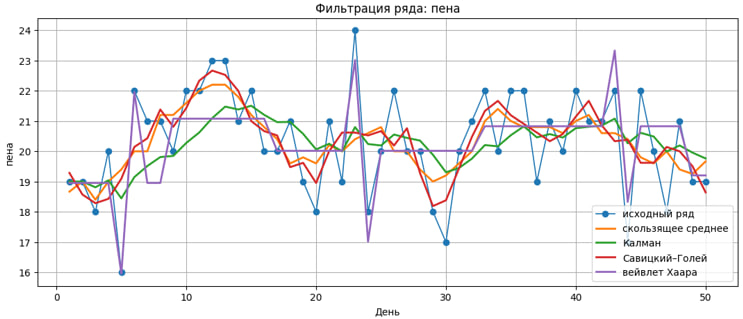  
**Рисунок 8 – Фильтрация ряда «прибыль»**  
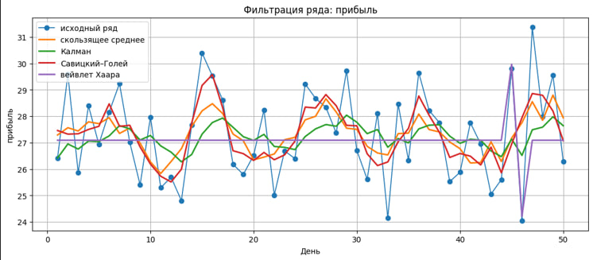

## 6. Статистический анализ данных

Вычислены основные описательные статистики (таблица 3). Прибыль имеет среднее 27.32 тыс. руб. и стандартное отклонение 1.73, что говорит об умеренной волатильности. Наибольшая вариативность у мыла (CV≈16.8%), наименьшая – у краски (CV≈3.96%).

**Таблица 3 – Описательные статистики**

| Показатель | Среднее | Стандартное отклонение | Минимум | Максимум |
|------------|---------|------------------------|---------|----------|
| мыло       | 97.120  | 16.329                 | 65.000  | 127.000  |
| порошок    | 19.160  | 4.442                  | 11.000  | 27.000   |
| средство   | 21.280  | 3.058                  | 14.000  | 28.000   |
| краска     | 43.180  | 1.711                  | 40.000  | 46.000   |
| пена       | 20.300  | 1.717                  | 16.000  | 24.000   |
| прибыль    | 27.317  | 1.733                  | 24.039  | 31.368   |

## 7. Корреляционный анализ

Построена матрица корреляций Пирсона (рисунок 9). Нас прежде всего интересует связь товарных показателей с прибылью (таблица 4).

**Рисунок 9 – Матрица корреляций**  
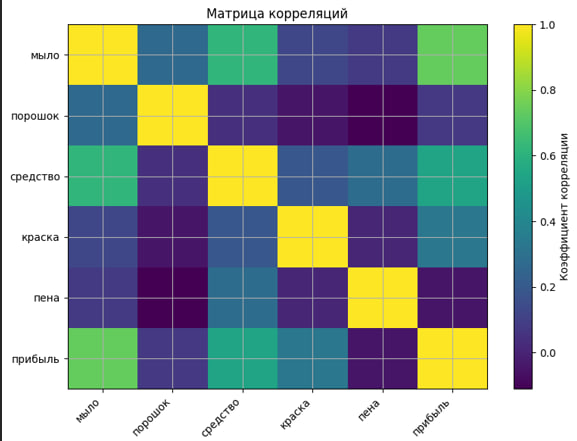

**Таблица 4 – Корреляция товаров с прибылью**

| Показатель | Корреляция с прибылью |
|------------|-----------------------|
| мыло       | 0.738                 |
| средство   | 0.540                 |
| краска     | 0.329                 |
| порошок    | 0.072                 |
| пена       | -0.050                |

**Вывод:** Наибольшее положительное влияние на прибыль оказывают продажи мыла и средства. Связь порошка и пены практически отсутствует, что может указывать на их низкую маржинальность или сезонный характер, не отражённый в 50 днях.

## 8. Автокорреляция и поиск периодичности

Автокорреляционная функция (ACF) прибыли вычислена для лагов до 25 (рисунок 10). Значимые выбросы наблюдаются на лагах 11 (0.433) и 14 (-0.384). Однако при длине ряда 50 такие значения не являются статистически строгими (критическое значение 95% доверительного интервала ~0.28). Тем не менее, гипотеза о слабой 11-дневной цикличности может быть проверена далее.

**Рисунок 10 – Автокорреляция прибыли**  
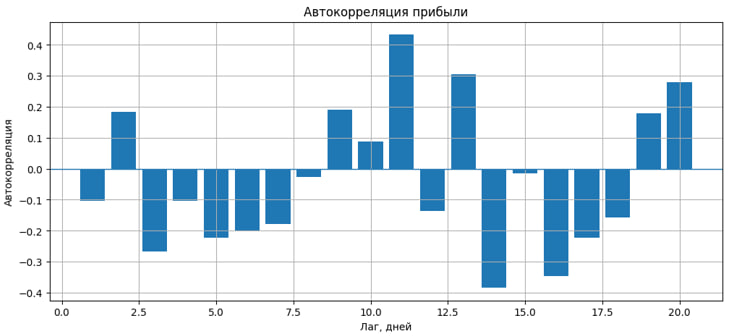

**Таблица 5 – Наиболее заметные автокорреляции**

| Лаг | Автокорреляция |
|-----|----------------|
| 11  | 0.433          |
| 14  | -0.384         |
| 16  | -0.347         |
| 13  | 0.304          |
| 20  | 0.279          |

Дополнительно проведён спектральный анализ через быстрое преобразование Фурье (FFT) после удаления линейного тренда. Спектр мощности (рисунок 11) показывает доминирующую частоту, соответствующую периоду 10 дней (таблица 6). Это согласуется с пиком автокорреляции на лаге 11, учитывая дискретность и ограниченную длину ряда.

**Рисунок 11 – Спектр мощности для прибыли**  
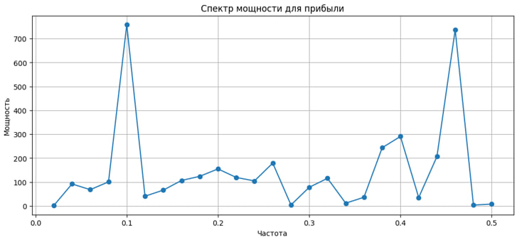

**Таблица 6 – Наиболее выраженные периоды по FFT**

| Период, дней | Мощность |
|--------------|----------|
| 10.000       | 757.84   |
| 2.174        | 736.74   |
| 2.500        | 290.60   |
| 2.632        | 243.58   |
| 2.273        | 206.39   |

**Осторожный вывод:** Данные намекают на наличие 10–11-дневной квазипериодичности, но из-за малой выборки (50 дней) это не может считаться доказательством устойчивой сезонности.

## 9. Дополнительная часть: внешний датасет UCI Air Quality

Выбран открытый датасет [UCI Air Quality](https://archive.ics.uci.edu/ml/datasets/Air+Quality), содержащий почасовые измерения концентрации загрязняющих веществ (CO, NMHC, C6H6 и др.) и показания пяти металлооксидных сенсоров. Данные охватывают период около года, но для сопоставимости с основной частью взяты первые 500 часов.

### 9.1 Предобработка и стандартизация

Поскольку сенсоры имеют разные единицы измерения (мг/м³, мкг/м³ и безразмерные условные единицы), все ряды стандартизированы (вычитание среднего, деление на стандартное отклонение). Это позволяет визуально сравнить динамику (рисунок 12).

**Рисунок 12 – Стандартизированные показания сенсоров**  
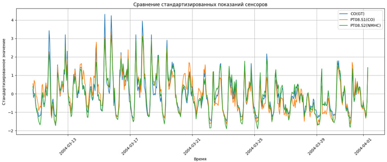

### 9.2 Корреляционный анализ

Матрица корреляций (рисунок 13) показывает сильную связь между истинной концентрацией CO(GT) и сенсорами PT08.S1(CO) (r=0.929) и PT08.S2(NMHC) (r=0.964). Это подтверждает, что сенсоры адекватно отслеживают динамику, а измерительный шум невелик.

**Рисунок 13 – Корреляции в датасете Air Quality**  
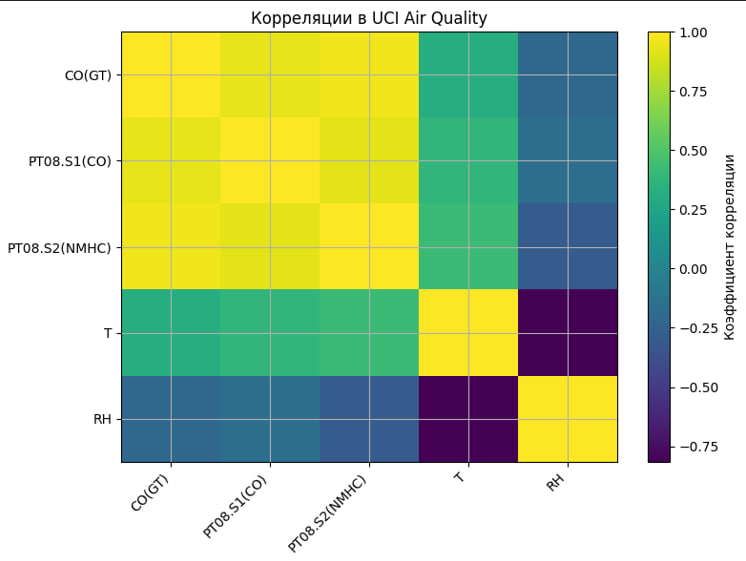

### 9.3 Фильтрация сенсорного ряда

Для примера взят ряд PT08.S1(CO) и к нему применены те же четыре фильтра (рисунок 14). Скользящее среднее и фильтр Савицкого–Голея эффективно убирают высокочастотные выбросы, при этом последний лучше сохраняет резкие скачки, характерные для загрязнения воздуха (например, утренние часы пик). Фильтр Калмана даёт очень гладкую оценку, пригодную для долгосрочного тренда. Вейвлет-фильтрация удаляет мелкий шум, но оставляет значимые колебания.

**Рисунок 14 – Фильтрация сенсорного ряда PT08.S1(CO)**  
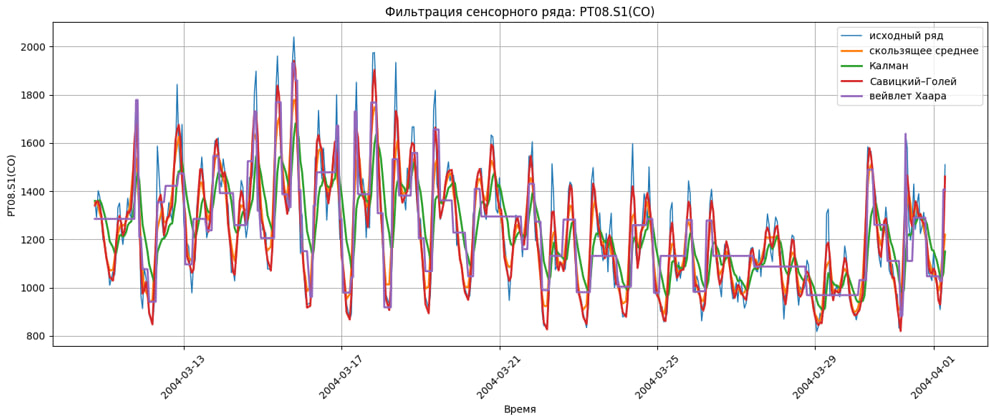

**Вывод для дополнительной части:** Методы фильтрации успешно применяются к физическим сенсорным данным. Выбор фильтра зависит от цели: для выделения тренда лучше Калман, для сохранения экстремумов – Савицкий–Голей, для быстрой обработки – скользящее среднее.

## 10. Выводы по всей работе

В ходе лабораторной работы выполнены следующие задачи:

1. **Реализованы четыре метода фильтрации временных рядов:** скользящее среднее, фильтр Калмана, фильтр Савицкого–Голея и вейвлет-фильтрация Хаара. Все методы корректно работают на данных продаж и сенсорных данных.

2. **Проведено сравнение методов** на ряде «Прибыль» по двум метрикам:  
   - Фильтр Калмана показал максимальное снижение шероховатости (85.45%) – наилучшее сглаживание.  
   - Фильтр Савицкого–Голея – минимальное среднее абсолютное отклонение (1.073), т.е. наименьшее искажение исходной формы.  
   - Вейвлет-фильтрация уступила по обеим метрикам, что объясняется коротким рядом и мягким порогом; для более длинных данных её эффективность выше.

3. **Статистический и корреляционный анализ** выявил, что прибыль сильнее всего коррелирует с продажами мыла (0.738) и средства (0.540). Это указывает на ключевые товары, управляя которыми можно влиять на итоговую прибыль.

4. **Автокорреляционный и спектральный анализ** показали возможную 10–11-дневную периодичность прибыли, но из-за ограниченной длины ряда (50 точек) этот результат требует подтверждения на более длинных данных.

5. **Внешний датасет UCI Air Quality** продемонстрировал применимость тех же методов к многомерным сенсорным данным. Фильтрация помогает подавить шум измерений и выделить значимые изменения концентрации загрязнителей, что важно для систем мониторинга.

**Итоговое заключение:** Все цели работы достигнуты. Реализованные фильтры различаются по степени сглаживания и сохранению формы; выбор конкретного метода зависит от задачи – либо максимум гладкости, либо минимум искажения. Рекомендуется в экономических задачах использовать фильтр Савицкого–Голея для сохранения локальных пиков, а для задач управления – фильтр Калмана, дающий устойчивую оценку тренда.