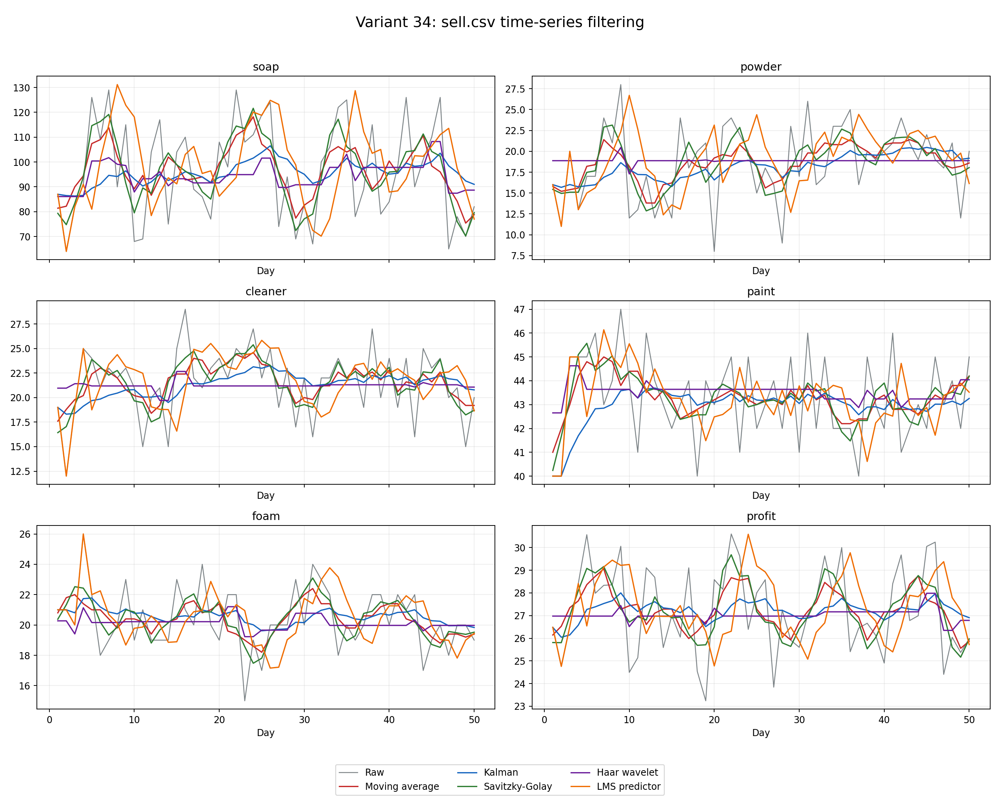
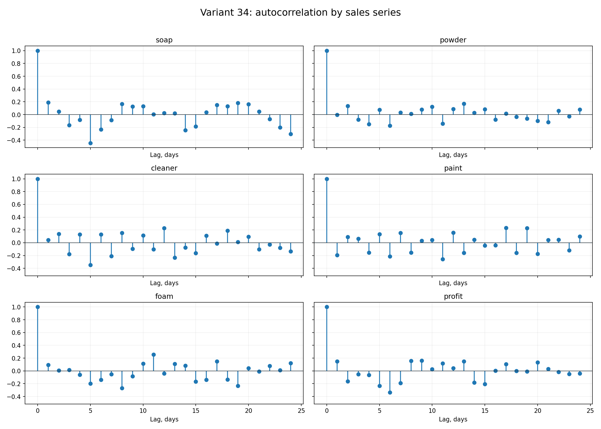
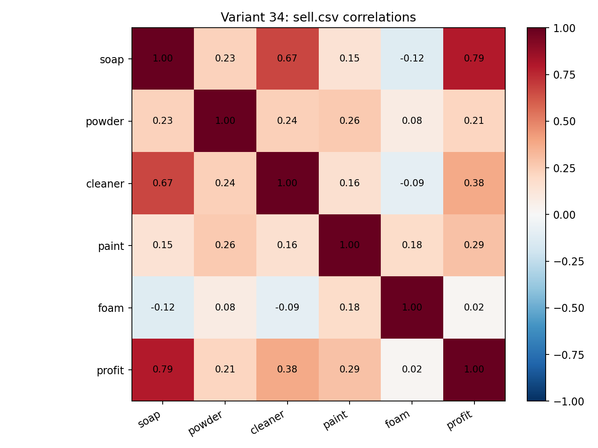
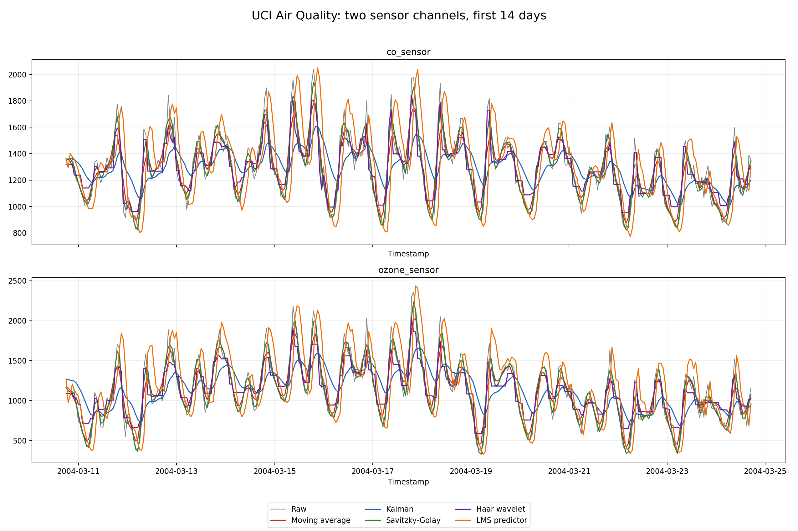
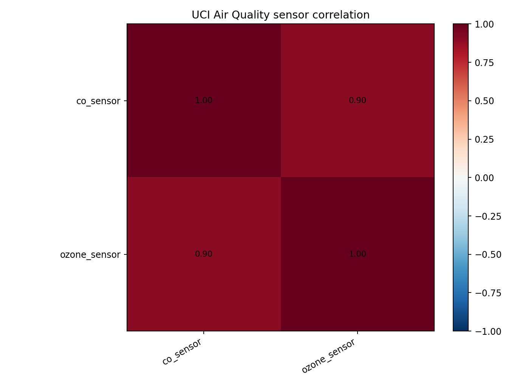

# Лабораторная работа 3

## 1. Цель задачи

В работе реализованы методы фильтрации временных рядов и проведен анализ данных:

- реализованы три базовых фильтра: скользящее среднее, одномерный фильтр Калмана и фильтр Савицкого - Голея
- рассчитаны статистики, корреляции, автокорреляции и оценки периодичности
- для hard-свободы исследованы два сенсорных канала из внешнего набора данных

Основной сценарий исследования находится в [Research.ipynb](./Research.ipynb), реализации методов - в [src](./src).

## 2. Реализованные методы

Код фильтров находится в [src/Filters.py](./src/Filters.py).

| Метод | Назначение в эксперименте |
|---|---|
| `moving_average` | локальное усреднение по окну |
| `kalman_filter_1d` | рекурсивная оценка скрытого уровня ряда по шумным измерениям |
| `savitzky_golay_filter` | локальная полиномиальная аппроксимация, сохраняющая форму пиков лучше простого усреднения |
| `haar_wavelet_denoise` | hard-метод: многоуровневое Haar-разложение и soft-threshold для detail-коэффициентов |
| `lms_predictive_filter` | hard-метод: адаптивный LMS-предиктор по предыдущим значениям ряда |

В реализации вейвлета не используется готовый black-box вызов: прямое и обратное Haar-преобразование, оценка порога и thresholding реализованы в коде работы.

## 3. Данные `sell.csv`
Мой вариант 34.

Загрузчик в [src/DataProcessing.py](./src/DataProcessing.py) берет из CSV только колонки варианта 34: дневные продажи мыла, порошка, средства, краски, пены и прибыль. Выделенная таблица сохранена в [report_assets/sell_variant_34.csv](./report_assets/sell_variant_34.csv).

## 4. Сравнение фильтров на `sell.csv`

График ниже показывает исходные ряды и все пять реализованных фильтров.

У ряда нет эталонного чистого сигнала, поэтому качество сглаживания оценивается качественно по графикам и через roughness: средний модуль разности соседних точек. Полная таблица метрик находится в [report_assets/sell_filter_metrics.csv](./report_assets/sell_filter_metrics.csv).

Для прибыли отношение roughness к исходному ряду получилось таким:

| Метод | Roughness / raw |
|---|---:|
| `moving_average` | 0.256 |
| `kalman` | 0.124 |
| `savitzky_golay` | 0.335 |
| `haar_wavelet` | 0.065 |
| `lms` | 0.493 |

Скользящее среднее и фильтр Савицкого - Голея дают мягкое локальное сглаживание и сохраняют краткосрочную форму ряда. Калман и Haar сильнее подавляют скачки; на коротких дневных рядах Haar становится ступенчатым. LMS-предиктор зависит от предыдущих наблюдений, поэтому на резких сменах уровня может запаздывать или переоценивать пик.

## 5. Анализ варианта 34

Сводные характеристики сохранены в [report_assets/sell_series_summary.csv](./report_assets/sell_series_summary.csv).

| Ряд | Mean | Std | Lag-1 autocorr | Dominant period, days |
|---|---:|---:|---:|---:|
| `soap` | 96.40 | 19.63 | 0.193 | 19 |
| `powder` | 18.56 | 4.49 | -0.005 | 13 |
| `cleaner` | 21.52 | 3.40 | 0.041 | 12 |
| `paint` | 43.26 | 1.79 | -0.200 | 17 |
| `foam` | 20.40 | 1.99 | 0.096 | 11 |
| `profit` | 27.26 | 1.91 | 0.150 | 9 |

Оценки периодов на 50 дневных точках надо читать осторожно, тк это максимумы автокорреляции на коротком отрезке, а не доказательство устойчивого сезонного цикла. Трендовые коэффициенты малы по масштабу рядов, поэтому на этом окне выраженного монотонного роста или падения не видно.

Матрица корреляций показывает:

- прибыль сильнее всего связана с `soap`
- продажи `soap` и `cleaner` также заметно движутся вместе
- связь `foam` и `profit` почти отсутствует

## 6. Hard-свобода: два сенсорных канала

Для дополнительного эксперимента взят официальный [UCI Air Quality dataset](https://archive.ics.uci.edu/dataset/360/air+quality). В нем есть часовые отклики массива газовых сенсоров. В работе выбраны каналы `PT08.S1(CO)` и `PT08.S5(O3)`. Исходный CSV размещен в [data](./data), а обработка пропусков и выбор каналов реализованы в [src/DataProcessing.py](./src/DataProcessing.py).

После удаления служебных колонок, замены маркеров пропусков и интерполяции двух каналов осталось `9357` часовых точек.

| Ряд | Mean | Std | Lag-1 autocorr | Dominant period, hours |
|---|---:|---:|---:|---:|
| `co_sensor` | 1103.06 | 218.18 | 0.890 | 24 |
| `ozone_sensor` | 1032.54 | 404.43 | 0.907 | 24 |

Оба сенсорных ряда имеют сильную инерционность и суточную повторяемость. Их корреляция равна `0.902`, поэтому колебания двух каналов в выбранном фрагменте во многом синхронны. При этом второй канал имеет больший разброс.

На часовых сенсорах Калман уменьшил roughness примерно до `0.234` и `0.239` от исходных рядов, moving average - до `0.529` и `0.550`. Савицкий - Голей и Haar сохранили больше локальной динамики. LMS в такой predictive-настройке roughness увеличил, что показывает его чувствительность к резким суточным пикам и необходимость подбора порядка/шага под конкретный сигнал.

## 7. Выводы

1. Построены графики всех реализованных фильтров и проведен анализ продаж.
2. Универсального сглаживателя нет: более сильное подавление roughness одновременно увеличивает отклонение от наблюдаемых пиков.
3. На коротких продажах хорошо видна разница между мягкими локальными фильтрами и сильным рекурсивным/вейвлет-сглаживанием.
4. Многосенсорный набор UCI подтвердил суточную периодичность газовых сенсоров и высокую согласованность двух выбранных каналов.

## 8. Материалы

- [Research.ipynb](./Research.ipynb)
- [src/Filters.py](./src/Filters.py)
- [src/DataProcessing.py](./src/DataProcessing.py)
- [src/TimeSeriesAnalysis.py](./src/TimeSeriesAnalysis.py)
- [src/ToolsResearch.py](./src/ToolsResearch.py)
- [report_assets](./report_assets)
