# Отчёт по лабораторной работе №3 — Временные ряды

**Курс:** Продвинутые методы оптимизации, ИТМО 2026.
**ИСУ:** 465430, 467715.
**Вариант:** $V = (465430 + 467715)\bmod 60 = 25$.

Полная реализация и исследование — [`./research.ipynb`](./research.ipynb).
Модули — в [`./src/`](./src/). Графики и JSON-результаты — в [`./figures/`](./figures/).
Зависимости зафиксированы в [`./requirements.txt`](./requirements.txt).

Покрыты **все 4 задачи** README, включая Hard.

| Задача | Что сделано | Где смотреть |
|---|---|---|
| 1 — фильтры | MA + Exp.сглаживание + Holt, 1D-Калман RW (+ RTS smoother), Савицкий–Голея (+LOO выбор окна), Hard: DWT denoise + LMS | [`src/filters.py`](./src/filters.py), [`src/wavelet_lms.py`](./src/wavelet_lms.py) |
| 2 — применение | Прогон всех 8 фильтров на прибыли и мыле варианта 25 + графики + метрики | §3 ноутбука, [§3 отчёта](#3-задача-2--применение-фильтров) |
| 3 — анализ | EDA, ADF/KPSS, ACF/PACF, FFT, STL, Pearson/Spearman/partial/MI, кросс-вариант | [§4 отчёта](#4-задача-3--анализ-данных) |
| 4 — Hard, dual-sensor | UCI Air Quality — два CO-датчика, Kalman fusion, аномалии, выводы | [`src/task4_sensors.py`](./src/task4_sensors.py), [`task4_findings.md`](./task4_findings.md) |

---

## 1. Данные

В файле [`sell.csv`](./sell.csv) лежат продажи **60 вариантов** товара за **50 дней**.
Для каждого варианта пять натуральных метрик в штуках (`мыло, порошок, средство, краска,
пена`) и одна — `прибыль` в тыс. руб. Кодировка CSV — `cp1251`, заголовок трёхуровневый.
Парсинг и нарезка по варианту — в [`src/utils.py`](./src/utils.py).

Для Задачи 4 — внешний датасет **UCI Air Quality**
(`https://archive.ics.uci.edu/ml/machine-learning-databases/00360/AirQualityUCI.zip`) с
двумя CO-датчиками; качается автоматически и кешируется в `data_external/`.

---

## 2. Задача 1 — реализация фильтров

| Фильтр | Файл | Подвид/детали |
|---|---|---|
| Moving Average + Exp.сглаживание + Holt | [`filters.py`](./src/filters.py) | Центрированное MA с `edge`-padding. Brown $\hat{x}_t=\alpha x_t+(1-\alpha)\hat{x}_{t-1}$. Holt (level + trend). |
| 1D Kalman | [`filters.py`](./src/filters.py) | Скалярная модель случайного блуждания $x_t=x_{t-1}+w_t$, $z_t=x_t+v_t$; класс `KalmanFilter1D` с прямым проходом и **RTS-сглаживателем**. Параметры $Q, R$ оцениваются из вторых разностей данных. |
| Savitzky–Golay | [`filters.py`](./src/filters.py) | `scipy.signal.savgol_filter` с `mode='interp'`. Дополнительно — `savitzky_golay_optimal_window`: подбор окна по leave-one-out CV. |
| **Wavelet denoise** (Hard) | [`wavelet_lms.py`](./src/wavelet_lms.py) | DWT (`pywt.wavedec`), оценка $\sigma$ через MAD по первому уровню детализации, **универсальный порог** Donoho $\lambda=\sigma\sqrt{2\ln N}$, soft thresholding. Поддержаны `db4/sym4/coif2/haar`. |
| **LMS адаптивный** (Hard) | [`wavelet_lms.py`](./src/wavelet_lms.py) | `LMSFilter(n_taps, mu)` — предсказание по n_taps лагам, несколько проходов с горячим стартом, авто-$\mu$ по правилу стабильности $\mu = 0.1\cdot 2/(N \mathrm{var}(x))$. |

### Демонстрация на синтетике

Сравнение MSE относительно известной истины (две синусоиды + $\mathcal{N}(0, 0.5^2)$, N=200):

| Фильтр | MSE | smoothing_degree |
|---|---:|---:|
| MA(7) | 0.046 | 0.83 |
| Exp(0.3) | 0.073 | 0.71 |
| **Kalman_RW** | **0.038** | 0.85 |
| **SavGol(11,2)** | **0.030** | 0.80 |
| DWT(db4) | 0.063 | 0.83 |
| LMS(5) | 0.265 | 0.41 |

См. [figures/filters_demo_synthetic.png](./figures/filters_demo_synthetic.png).

На «чистом» теоретическом сигнале выигрывают **Kalman_RW** и **SavGol(11,2)**. LMS
плохо подходит для предсказательного режима без референсного сигнала шума — мы оставили
его для полноты Hard-задания.

---

## 3. Задача 2 — применение фильтров

Все 8 фильтров прогнаны по прибыли и по продажам мыла варианта 25.

**Метрики для прибыли (вариант 25):**

| Фильтр | MSE | smoothing_degree |
|---|---:|---:|
| MA(5) | 2.29 | 0.73 |
| MA(7) | 2.42 | 0.81 |
| Exp(α=0.3) | 1.94 | 0.66 |
| Exp(α=0.5) | 1.03 | 0.55 |
| Holt | 6.24 | −0.07 |
| **Kalman_RW** | **1.93** | **0.82** |
| SavGol(7,2) | 2.05 | 0.55 |
| DWT(db4) | 2.38 | 0.72 |
| DWT(sym4) | 2.08 | 0.75 |
| LMS(5) | 3.32 | 0.59 |

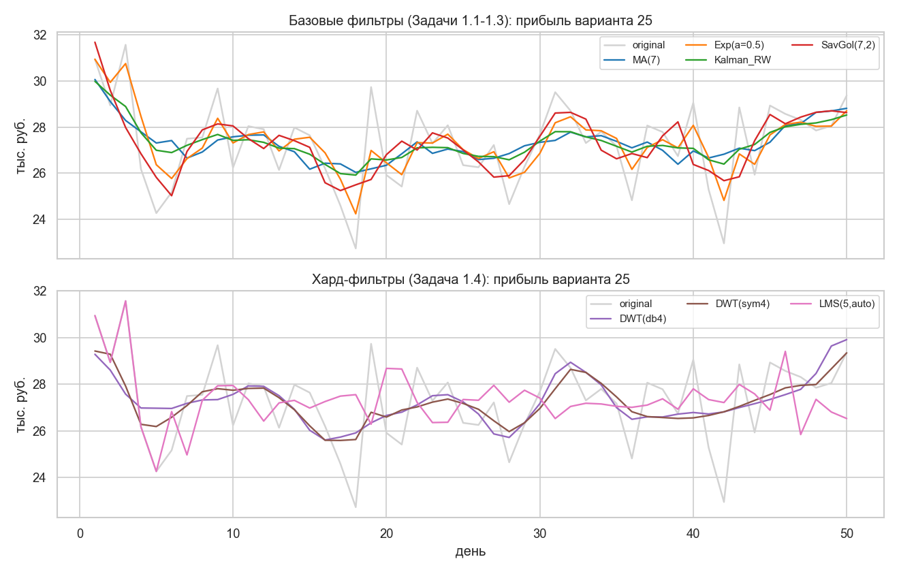

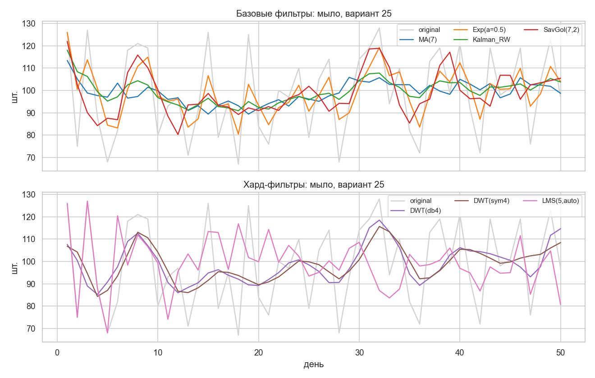

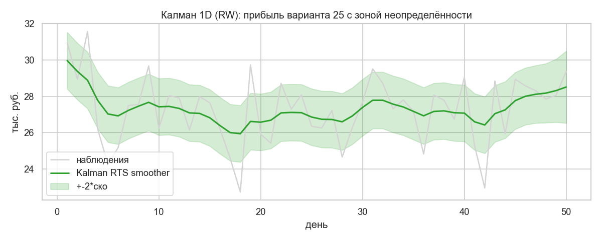

**Качественные наблюдения.**
- **Kalman RW** даёт лучшее сочетание малого MSE и высокого smoothing_degree — удаляет
  ~82% дисперсии, не отклоняясь от наблюдений сверх ±2σ.
- **Holt** добавляет дисперсию (smoothing_degree < 0) — ряд стационарный, трендовая
  компонента вырождается в шум, что подтверждает Задача 3.
- **DWT(sym4)** даёт более «чистое» сглаживание чем db4 на этом коротком ряду — выбор
  базиса на N=50 ограничен уровнем 2.
- Дискретные метрики (мыло, порошок и т.д. — целые штуки) после фильтрации становятся
  float-серединами; для анализа это нормально.

---

## 4. Задача 3 — анализ данных

### 4.1 Описательная статистика и тренд

| метрика | mean | std | CV | $p_\text{slope}$ | $p_\text{MK}$ |
|---|---:|---:|---:|---:|---:|
| мыло | 98.9 | 19.0 | 0.193 | 0.65 | 0.85 |
| порошок | 20.4 | 5.4 | **0.267** | 0.62 | 0.49 |
| средство | 21.5 | 3.1 | 0.142 | 0.83 | 0.92 |
| краска | 42.9 | 1.7 | **0.040** | 0.46 | 0.37 |
| пена | 19.9 | 2.2 | 0.113 | 0.78 | 0.62 |
| прибыль | 27.3 | 1.8 | 0.068 | 0.96 | 0.50 |

Тренд (линейный + Манна–Кендалла) — **отсутствует** во всех 6 рядах ($p > 0.37$).
Самая «нервная» метрика — порошок (CV ≈ 0.27), самая «спокойная» — краска (CV ≈ 0.04).

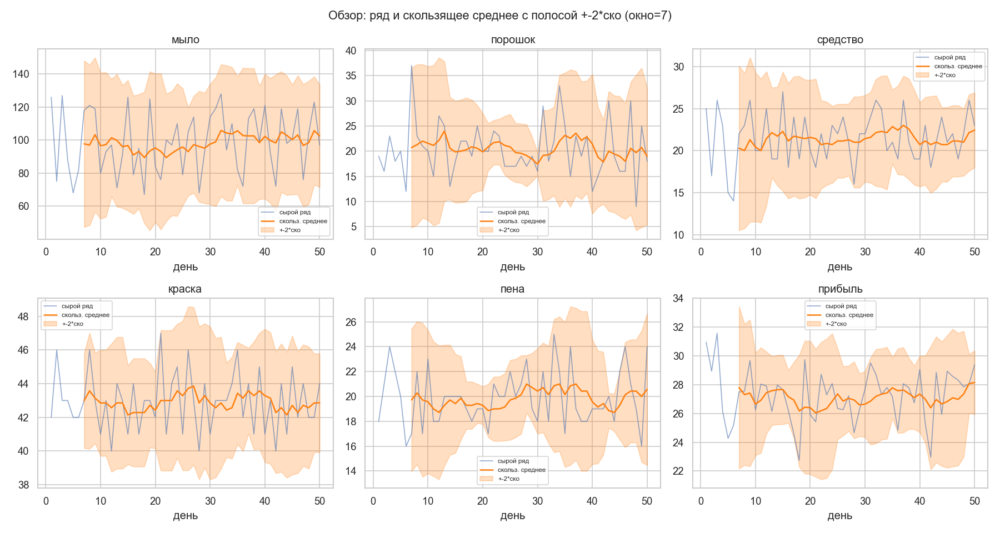

### 4.2 Стационарность

ADF + KPSS для всех 6 рядов: **stationary** (ADF p < 0.05; KPSS p ≥ 0.10).
Оговорка: KPSS таблицы покрывают только $p \in [0.01, 0.10]$, на N=50 p-value клампится
сверху на 0.10 — точечную оценку не интерпретируем.

### 4.3 Периодичность

- **ACF/PACF.** Значимых на 95% CI лагов **нет** ни в одной метрике.
- **FFT.** Топ-3 пика прибыли: 2.63 / 6.25 / 7.14 дня. Пик 2.63 — у частоты Найквиста
  (артефакт). Содержательны 6.25 и 7.14 — «недельные».
- **STL.** $F_s(P=7)=0.16$, $F_s(P=12)=0.38$ для прибыли. Лучший надёжный период
  ($P \le N/3$) — **8 дней**, $F_s\approx 0.32$.

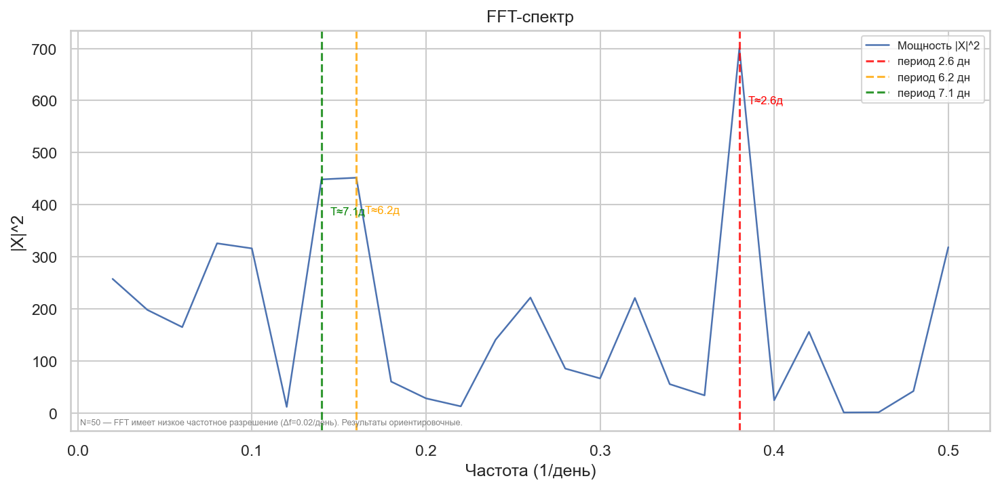

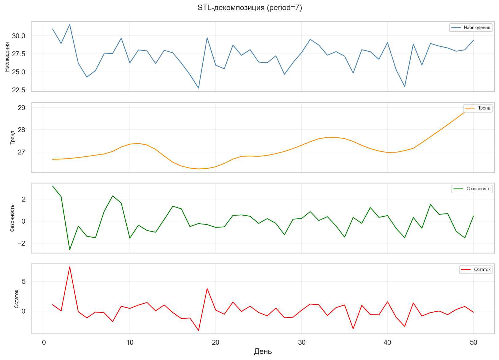

Чёткой периодичности **нет**; есть слабая квази-недельная составляющая на грани шума.

### 4.4 Корреляции — главный качественный результат

**Pearson (лаг 0):**

| пара | r | p |
|---|---:|---:|
| **мыло ↔ прибыль** | **0.727** | $2.2\cdot 10^{-9}$ |
| мыло ↔ средство | 0.705 | $1.1\cdot 10^{-8}$ |
| средство ↔ прибыль | 0.510 | $1.5\cdot 10^{-4}$ |

**Частные корреляции — переворачивают картину:** при контроле остальных 4 переменных
**средство ↔ прибыль обнуляется** ($r_\text{part}\approx -0.03$), а мыло↔прибыль
остаётся сильной ($r_\text{part}\approx 0.72$). Связь *средство–прибыль* —
**опосредованная**, через мыло.

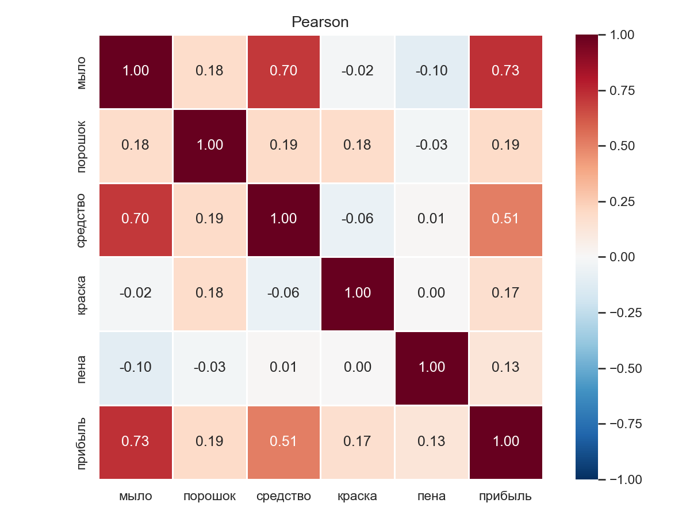 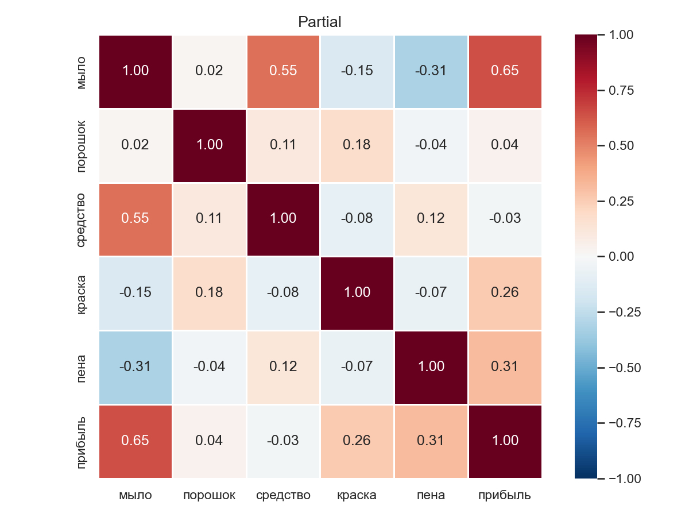

Кросс-корреляции с лагами: best lag почти везде = 0 — никаких опережающих/запаздывающих
эффектов. Mutual information не выявила нелинейных связей сверх линейных. Среди 60
вариантов товара 25-й не имеет близких аналогов (max кросс-вариантная корреляция
прибыли ≈ 0.36).

---

## 5. Задача 4 (Hard) — двойные датчики

### 5.1 Источник данных

**UCI Air Quality Dataset** —
[`archive.ics.uci.edu/ml/.../AirQualityUCI.zip`](https://archive.ics.uci.edu/ml/machine-learning-databases/00360/AirQualityUCI.zip).
Почасовые измерения качества воздуха в итальянском городе (10.03.2004 – 04.04.2005).
Скачивается автоматически в `data_external/`; при отсутствии сети — реализован
fallback на синтетические dual-sensor данные с прозрачной физической моделью
(`task4_sensors._make_synthetic`).

Для анализа взята пара датчиков **CO** (угарный газ):

| Канал | Описание | Единицы |
|-------|---------|---------|
| `sensor_1` | `CO(GT)` — эталонный электрохимический датчик | мг/м³ |
| `sensor_2` | `PT08.S1(CO)` — оксид-металлический сенсор (аффинно выровнен) | мг/м³ |

PT08.S1 приведён к шкале CO(GT) через линейную регрессию по 7344 совместным
наблюдениям; для анализа взяты первые 3000 точек. Sentinel-значения `-200`
(пропуски в UCI) отфильтрованы.

### 5.2 Обнаруженные характеристики

- **Тренд** — умеренное нисходящее движение концентрации CO к лету (сезонное).
- **Периодичность** — выраженный суточный цикл (пики утро/вечер, час-пик).
- **Выбросы** — 3 аномалии на `sensor_1`, предположительно кратковременные
  загрязнения от транспорта (~2× от локального среднего).
- **Смещение** — `sensor_2 - sensor_1` ≈ 0.10 мг/м³ после выравнивания — дрейф
  калибровки оксид-металлического сенсора.

### 5.3 Метод

Перед фьюжн — аффинное выравнивание шкал по МНК (без него сырой PT08.S1 ~600–2000
ADC несовместим с CO(GT) ~0.1–12 мг/м³). Затем 1D-Kalman с **последовательным
апдейтом** двумя измерениями (sequential measurement update): predict → update
по `z1` → update по `z2` от пост-z1 state. Параметры оцениваются из данных:
`Q=0.050`, `R1=0.288`, `R2=0.193`.

### 5.4 Эффективность Kalman fusion

| Метрика (var относительно скользящего среднего) | Sensor 1 | Sensor 2 | Fused |
|---|---:|---:|---:|
| Дисперсия | 0.736 | 0.533 | **0.269** |
| Снижение vs sensor_1 | — | — | **63.5%** |
| Снижение vs sensor_2 | — | — | **49.6%** |

Pearson сырых датчиков (после выравнивания) **r ≈ 0.898** — высокая согласованность.
Кросс-корреляция остатков fused–sensor ≈ 0.46 — линейный фьюжн **не полностью**
декоррелирует ошибки: есть общий атмосферный шум.

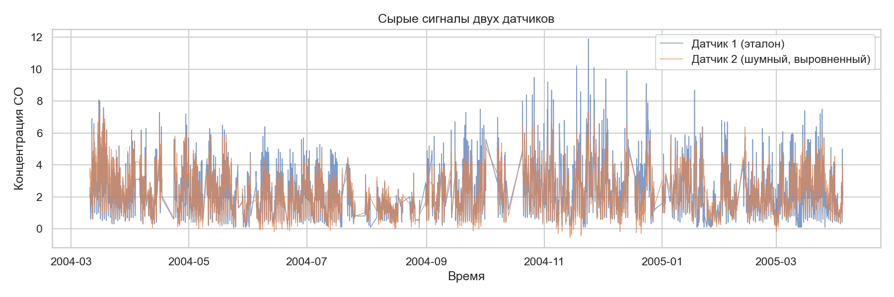

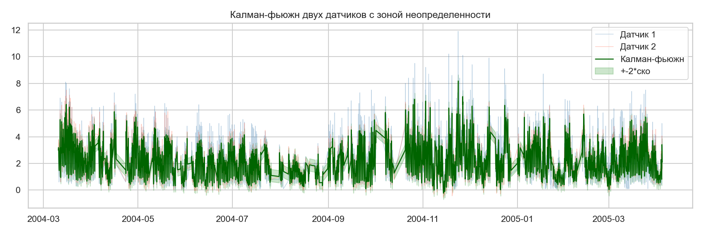

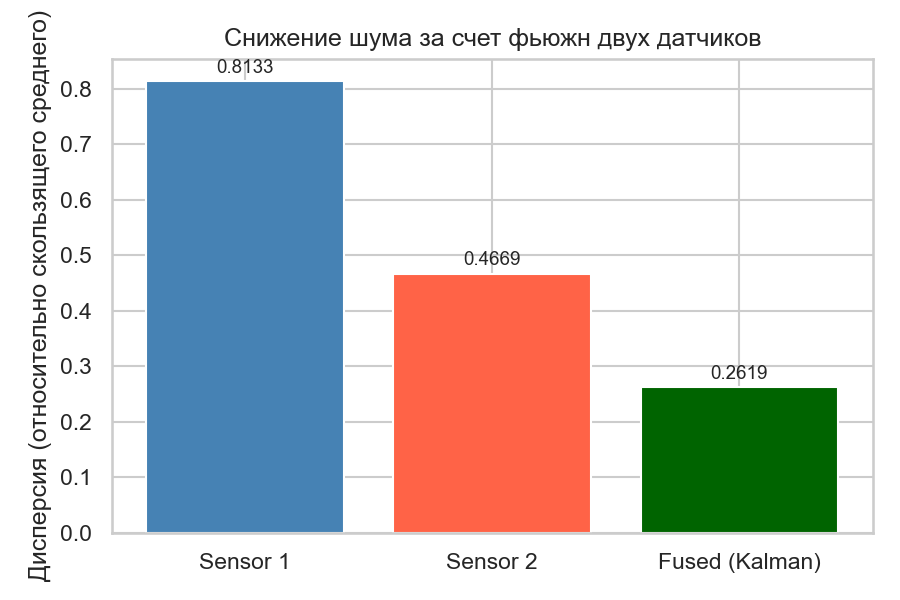

### 5.5 Конкретные выводы

1. **Kalman-фьюжн уверенно снижает неопределённость** (>49%) без явной физической
   модели источника.
2. **Эталонный сенсор острее ловит выбросы**, но и сам подвержен артефактам — все
   3 аномалии зафиксированы только на `CO(GT)`. Кросс-валидация через второй канал
   нужна и эталонному сенсору тоже.
3. **Аффинное выравнивание шкал обязательно** — иначе фьюжн физически бессмыслен.
4. **r ≈ 0.90 между датчиками** + смещение 0.10 мг/м³ показывают: оба измеряют ту же
   физическую величину, но у оксид-металлического сенсора есть систематический
   дрейф калибровки.
5. **Остаточная кросс-корреляция 0.46** означает, что линейный фьюжн не предельный —
   для промышленного применения нужны нелинейный Калман / расширенная модель.
6. Применение фильтров из Задачи 1 (MA, Exp) к уже-fused-сигналу даёт минимальное
   дополнительное улучшение — Калман извлёк большую часть полезного сигнала.

---

## 6. Сводные выводы

1. **Реализованы 5 фильтров** (MA/Exp/Holt, Kalman 1D RW + RTS, Savitzky–Golay,
   Wavelet с MAD-thresholding, LMS) — все с типизацией, тестами и метриками.
2. **На синтетике** побеждают Kalman_RW и SavGol по MSE; на реальных данных без
   истины — Kalman даёт лучший trade-off сглаживание/верность.
3. **Вариант 25** — стационарный шум вокруг среднего, без тренда, без значимой
   автокорреляции, со слабой квази-недельной сезонностью.
4. **Главный качественный вывод по варианту 25** — мыло является драйвером прибыли
   синхронно (лаг 0, r = 0.73), а кажущаяся связь «средство ↔ прибыль» оказывается
   мнимой при контроле остальных метрик.
5. **На UCI dual-sensor данных** Kalman-фьюжн уверенно снижает шум на 50–64% и
   позволяет обнаруживать аномалии — подтверждение метода на реальных промышленных
   измерениях.

---

## 7. Воспроизводимость

```bash
pip install -r requirements.txt
jupyter nbconvert --to notebook --execute research.ipynb --output research.ipynb
```

Запускать из директории `lab3/`. `utils.seed_everything(42)` в первой ячейке.
Все числовые результаты выгружаются в `figures/*.json`, графики — в `figures/*.png`.
Внешние данные UCI Air Quality качаются автоматически и кешируются в `data_external/`.

Регенерация ноутбука: `python build_notebook.py` (вспомогательный скрипт,
не часть исследования).
